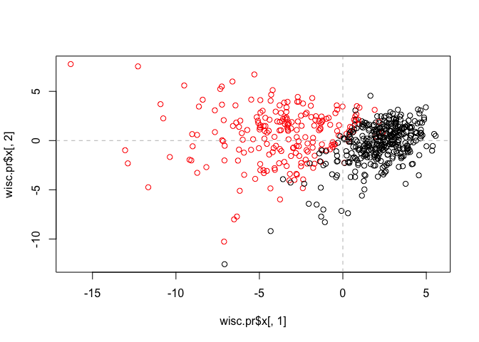
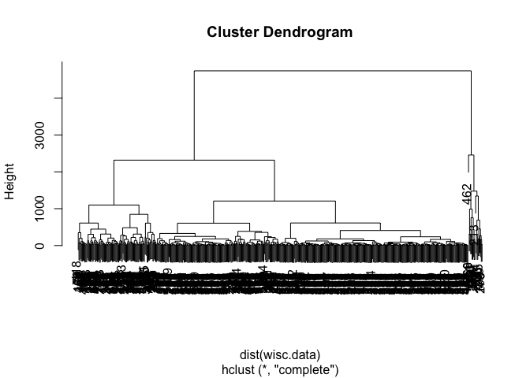
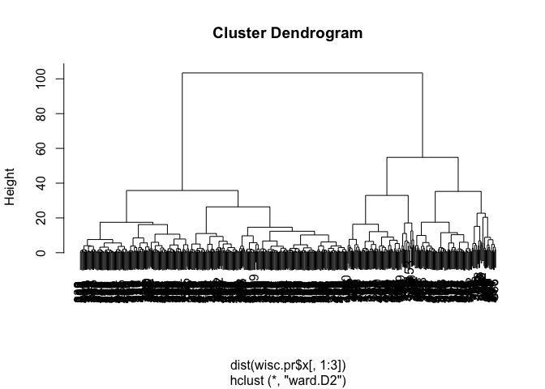
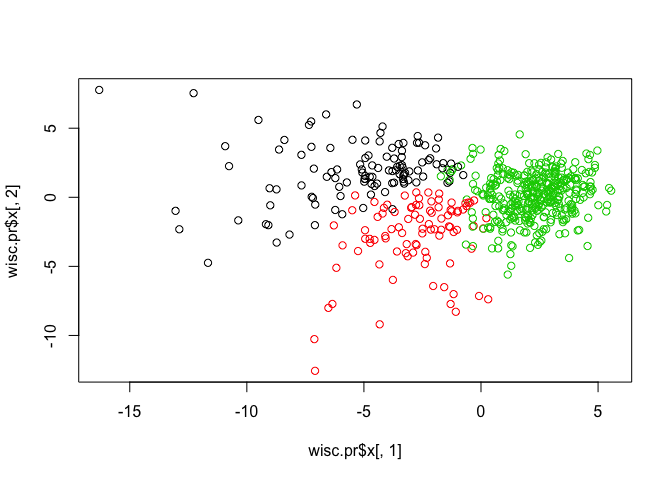

Class10
================
Nicholas Chen
2/6/2020

\#Analysis of Human Breast Cancer Cells

First we need to import (i.e. read) our input data. I downloaded the CSV
file from the class website:
<https://bioboot.github.io/bimm143_S18/class-material/WisconsinCancer.csv>

``` r
wisc.df <- read.csv("WisconsinCancer.csv")
head(wisc.df)
```

    ##         id diagnosis radius_mean texture_mean perimeter_mean area_mean
    ## 1   842302         M       17.99        10.38         122.80    1001.0
    ## 2   842517         M       20.57        17.77         132.90    1326.0
    ## 3 84300903         M       19.69        21.25         130.00    1203.0
    ## 4 84348301         M       11.42        20.38          77.58     386.1
    ## 5 84358402         M       20.29        14.34         135.10    1297.0
    ## 6   843786         M       12.45        15.70          82.57     477.1
    ##   smoothness_mean compactness_mean concavity_mean concave.points_mean
    ## 1         0.11840          0.27760         0.3001             0.14710
    ## 2         0.08474          0.07864         0.0869             0.07017
    ## 3         0.10960          0.15990         0.1974             0.12790
    ## 4         0.14250          0.28390         0.2414             0.10520
    ## 5         0.10030          0.13280         0.1980             0.10430
    ## 6         0.12780          0.17000         0.1578             0.08089
    ##   symmetry_mean fractal_dimension_mean radius_se texture_se perimeter_se
    ## 1        0.2419                0.07871    1.0950     0.9053        8.589
    ## 2        0.1812                0.05667    0.5435     0.7339        3.398
    ## 3        0.2069                0.05999    0.7456     0.7869        4.585
    ## 4        0.2597                0.09744    0.4956     1.1560        3.445
    ## 5        0.1809                0.05883    0.7572     0.7813        5.438
    ## 6        0.2087                0.07613    0.3345     0.8902        2.217
    ##   area_se smoothness_se compactness_se concavity_se concave.points_se
    ## 1  153.40      0.006399        0.04904      0.05373           0.01587
    ## 2   74.08      0.005225        0.01308      0.01860           0.01340
    ## 3   94.03      0.006150        0.04006      0.03832           0.02058
    ## 4   27.23      0.009110        0.07458      0.05661           0.01867
    ## 5   94.44      0.011490        0.02461      0.05688           0.01885
    ## 6   27.19      0.007510        0.03345      0.03672           0.01137
    ##   symmetry_se fractal_dimension_se radius_worst texture_worst perimeter_worst
    ## 1     0.03003             0.006193        25.38         17.33          184.60
    ## 2     0.01389             0.003532        24.99         23.41          158.80
    ## 3     0.02250             0.004571        23.57         25.53          152.50
    ## 4     0.05963             0.009208        14.91         26.50           98.87
    ## 5     0.01756             0.005115        22.54         16.67          152.20
    ## 6     0.02165             0.005082        15.47         23.75          103.40
    ##   area_worst smoothness_worst compactness_worst concavity_worst
    ## 1     2019.0           0.1622            0.6656          0.7119
    ## 2     1956.0           0.1238            0.1866          0.2416
    ## 3     1709.0           0.1444            0.4245          0.4504
    ## 4      567.7           0.2098            0.8663          0.6869
    ## 5     1575.0           0.1374            0.2050          0.4000
    ## 6      741.6           0.1791            0.5249          0.5355
    ##   concave.points_worst symmetry_worst fractal_dimension_worst  X
    ## 1               0.2654         0.4601                 0.11890 NA
    ## 2               0.1860         0.2750                 0.08902 NA
    ## 3               0.2430         0.3613                 0.08758 NA
    ## 4               0.2575         0.6638                 0.17300 NA
    ## 5               0.1625         0.2364                 0.07678 NA
    ## 6               0.1741         0.3985                 0.12440 NA

There are some funkey things in this dataset that we will ignore for our
analysis. This includes the first and second ID and Diagnosis columns
and the funny last X column (col 33).

``` r
wisc.data <- as.matrix( wisc.df[,3:32] )
head(wisc.data)
```

    ##      radius_mean texture_mean perimeter_mean area_mean smoothness_mean
    ## [1,]       17.99        10.38         122.80    1001.0         0.11840
    ## [2,]       20.57        17.77         132.90    1326.0         0.08474
    ## [3,]       19.69        21.25         130.00    1203.0         0.10960
    ## [4,]       11.42        20.38          77.58     386.1         0.14250
    ## [5,]       20.29        14.34         135.10    1297.0         0.10030
    ## [6,]       12.45        15.70          82.57     477.1         0.12780
    ##      compactness_mean concavity_mean concave.points_mean symmetry_mean
    ## [1,]          0.27760         0.3001             0.14710        0.2419
    ## [2,]          0.07864         0.0869             0.07017        0.1812
    ## [3,]          0.15990         0.1974             0.12790        0.2069
    ## [4,]          0.28390         0.2414             0.10520        0.2597
    ## [5,]          0.13280         0.1980             0.10430        0.1809
    ## [6,]          0.17000         0.1578             0.08089        0.2087
    ##      fractal_dimension_mean radius_se texture_se perimeter_se area_se
    ## [1,]                0.07871    1.0950     0.9053        8.589  153.40
    ## [2,]                0.05667    0.5435     0.7339        3.398   74.08
    ## [3,]                0.05999    0.7456     0.7869        4.585   94.03
    ## [4,]                0.09744    0.4956     1.1560        3.445   27.23
    ## [5,]                0.05883    0.7572     0.7813        5.438   94.44
    ## [6,]                0.07613    0.3345     0.8902        2.217   27.19
    ##      smoothness_se compactness_se concavity_se concave.points_se symmetry_se
    ## [1,]      0.006399        0.04904      0.05373           0.01587     0.03003
    ## [2,]      0.005225        0.01308      0.01860           0.01340     0.01389
    ## [3,]      0.006150        0.04006      0.03832           0.02058     0.02250
    ## [4,]      0.009110        0.07458      0.05661           0.01867     0.05963
    ## [5,]      0.011490        0.02461      0.05688           0.01885     0.01756
    ## [6,]      0.007510        0.03345      0.03672           0.01137     0.02165
    ##      fractal_dimension_se radius_worst texture_worst perimeter_worst area_worst
    ## [1,]             0.006193        25.38         17.33          184.60     2019.0
    ## [2,]             0.003532        24.99         23.41          158.80     1956.0
    ## [3,]             0.004571        23.57         25.53          152.50     1709.0
    ## [4,]             0.009208        14.91         26.50           98.87      567.7
    ## [5,]             0.005115        22.54         16.67          152.20     1575.0
    ## [6,]             0.005082        15.47         23.75          103.40      741.6
    ##      smoothness_worst compactness_worst concavity_worst concave.points_worst
    ## [1,]           0.1622            0.6656          0.7119               0.2654
    ## [2,]           0.1238            0.1866          0.2416               0.1860
    ## [3,]           0.1444            0.4245          0.4504               0.2430
    ## [4,]           0.2098            0.8663          0.6869               0.2575
    ## [5,]           0.1374            0.2050          0.4000               0.1625
    ## [6,]           0.1791            0.5249          0.5355               0.1741
    ##      symmetry_worst fractal_dimension_worst
    ## [1,]         0.4601                 0.11890
    ## [2,]         0.2750                 0.08902
    ## [3,]         0.3613                 0.08758
    ## [4,]         0.6638                 0.17300
    ## [5,]         0.2364                 0.07678
    ## [6,]         0.3985                 0.12440

Q. How many patients do we have data for?

``` r
nrow(wisc.data)
```

    ## [1] 569

Q. How many cancer and non-cancer?

``` r
table(wisc.df$diagnosis)
```

    ## 
    ##   B   M 
    ## 357 212

Q. How many variables/features in the data are suffixed with \_mean?

For this I will turn to the `grep()` function and look at the help page
to see how it works.

``` r
colnames(wisc.data)
```

    ##  [1] "radius_mean"             "texture_mean"           
    ##  [3] "perimeter_mean"          "area_mean"              
    ##  [5] "smoothness_mean"         "compactness_mean"       
    ##  [7] "concavity_mean"          "concave.points_mean"    
    ##  [9] "symmetry_mean"           "fractal_dimension_mean" 
    ## [11] "radius_se"               "texture_se"             
    ## [13] "perimeter_se"            "area_se"                
    ## [15] "smoothness_se"           "compactness_se"         
    ## [17] "concavity_se"            "concave.points_se"      
    ## [19] "symmetry_se"             "fractal_dimension_se"   
    ## [21] "radius_worst"            "texture_worst"          
    ## [23] "perimeter_worst"         "area_worst"             
    ## [25] "smoothness_worst"        "compactness_worst"      
    ## [27] "concavity_worst"         "concave.points_worst"   
    ## [29] "symmetry_worst"          "fractal_dimension_worst"

``` r
#to look at the column name
```

``` r
#grep(pattern, vector)
grep("_mean", colnames(wisc.data), value = TRUE)
```

    ##  [1] "radius_mean"            "texture_mean"           "perimeter_mean"        
    ##  [4] "area_mean"              "smoothness_mean"        "compactness_mean"      
    ##  [7] "concavity_mean"         "concave.points_mean"    "symmetry_mean"         
    ## [10] "fractal_dimension_mean"

``` r
grep("_mean", colnames(wisc.data))
```

    ##  [1]  1  2  3  4  5  6  7  8  9 10

``` r
# number of outcome columns
```

``` r
length( grep("_mean", colnames(wisc.data) ) )
```

    ## [1] 10

``` r
# number of total outcome columns
```

## Principal Component Analysis

Before we turn to PCA we need to think, or consider, whether we should
SCALE our input.

It is important to check if the data need to be scaled before performing
PCA. Recall two common reasons for scaling data include:

The input variables use different units of measurement.

  - The input variables have significantly different variances.
  - Check the mean and standard deviation of the features (i.e. columns)
    of the wisc.data to determine if the data should be scaled. Use the
    `colMeans()` and `apply()` functions like you’ve done
    before.

<!-- end list -->

``` r
round( apply(wisc.df, 2, sd), 2 )
```

    ## Warning in var(if (is.vector(x) || is.factor(x)) x else as.double(x), na.rm =
    ## na.rm): NAs introduced by coercion

    ##                      id               diagnosis             radius_mean 
    ##            125020585.61                      NA                    3.52 
    ##            texture_mean          perimeter_mean               area_mean 
    ##                    4.30                   24.30                  351.91 
    ##         smoothness_mean        compactness_mean          concavity_mean 
    ##                    0.01                    0.05                    0.08 
    ##     concave.points_mean           symmetry_mean  fractal_dimension_mean 
    ##                    0.04                    0.03                    0.01 
    ##               radius_se              texture_se            perimeter_se 
    ##                    0.28                    0.55                    2.02 
    ##                 area_se           smoothness_se          compactness_se 
    ##                   45.49                    0.00                    0.02 
    ##            concavity_se       concave.points_se             symmetry_se 
    ##                    0.03                    0.01                    0.01 
    ##    fractal_dimension_se            radius_worst           texture_worst 
    ##                    0.00                    4.83                    6.15 
    ##         perimeter_worst              area_worst        smoothness_worst 
    ##                   33.60                  569.36                    0.02 
    ##       compactness_worst         concavity_worst    concave.points_worst 
    ##                    0.16                    0.21                    0.07 
    ##          symmetry_worst fractal_dimension_worst                       X 
    ##                    0.06                    0.02                      NA

``` r
#round to 2 sig.fig.
```

Look like we need to set scale=TRUE

``` r
# Perform PCA on wisc.data by completing the following code
wisc.pr <- prcomp( wisc.data, scale=TRUE )
summary(wisc.pr)
```

    ## Importance of components:
    ##                           PC1    PC2     PC3     PC4     PC5     PC6     PC7
    ## Standard deviation     3.6444 2.3857 1.67867 1.40735 1.28403 1.09880 0.82172
    ## Proportion of Variance 0.4427 0.1897 0.09393 0.06602 0.05496 0.04025 0.02251
    ## Cumulative Proportion  0.4427 0.6324 0.72636 0.79239 0.84734 0.88759 0.91010
    ##                            PC8    PC9    PC10   PC11    PC12    PC13    PC14
    ## Standard deviation     0.69037 0.6457 0.59219 0.5421 0.51104 0.49128 0.39624
    ## Proportion of Variance 0.01589 0.0139 0.01169 0.0098 0.00871 0.00805 0.00523
    ## Cumulative Proportion  0.92598 0.9399 0.95157 0.9614 0.97007 0.97812 0.98335
    ##                           PC15    PC16    PC17    PC18    PC19    PC20   PC21
    ## Standard deviation     0.30681 0.28260 0.24372 0.22939 0.22244 0.17652 0.1731
    ## Proportion of Variance 0.00314 0.00266 0.00198 0.00175 0.00165 0.00104 0.0010
    ## Cumulative Proportion  0.98649 0.98915 0.99113 0.99288 0.99453 0.99557 0.9966
    ##                           PC22    PC23   PC24    PC25    PC26    PC27    PC28
    ## Standard deviation     0.16565 0.15602 0.1344 0.12442 0.09043 0.08307 0.03987
    ## Proportion of Variance 0.00091 0.00081 0.0006 0.00052 0.00027 0.00023 0.00005
    ## Cumulative Proportion  0.99749 0.99830 0.9989 0.99942 0.99969 0.99992 0.99997
    ##                           PC29    PC30
    ## Standard deviation     0.02736 0.01153
    ## Proportion of Variance 0.00002 0.00000
    ## Cumulative Proportion  1.00000 1.00000

``` r
# Scale: if TRUE, the centered column values are divided by the column’s standard deviation (when center is also TRUE; otherwise, the root mean square is used); if FALSE, scaling is not performed
```

Q. From your results, what proportion of the original variance is
captured by the first principal components (PC1)?

The 1st PC captures 44.27% of the original variance. Note that 72.6% is
captured in the first 3 PCs..

Lets make some figures…

``` r
biplot(wisc.pr)
```

<!-- -->

That is a hot mess\! We need to do our own PC1 vs PC2 plot and lets
color by the diagnosis.

``` r
attributes(wisc.pr)
```

    ## $names
    ## [1] "sdev"     "rotation" "center"   "scale"    "x"       
    ## 
    ## $class
    ## [1] "prcomp"

``` r
plot(wisc.pr$x[,1], wisc.pr$x[,2], col=wisc.df$diagnosis)
```

<!-- -->

``` r
plot(wisc.pr$x[,1], wisc.pr$x[,2], col=wisc.df$diagnosis)
abline(h=0, col="gray", lty=2)
abline(v=0, col="gray", lty=2)
```

<!-- -->

\#\#\#CLuster in PC space

cluster the original data

\#use

``` r
kmeans(wisc.data, centers = 2, nstart = 20)
```

    ## K-means clustering with 2 clusters of sizes 131, 438
    ## 
    ## Cluster means:
    ##   radius_mean texture_mean perimeter_mean area_mean smoothness_mean
    ## 1    19.37992     21.69458      128.23130 1185.9298       0.1012946
    ## 2    12.55630     18.57037       81.12347  496.0619       0.0948845
    ##   compactness_mean concavity_mean concave.points_mean symmetry_mean
    ## 1       0.14861298     0.17693947          0.10069878     0.1915397
    ## 2       0.09109982     0.06243776          0.03343254     0.1780580
    ##   fractal_dimension_mean radius_se texture_se perimeter_se  area_se
    ## 1             0.06060290 0.7428038   1.222538     5.250580 95.67817
    ## 2             0.06345402 0.3041909   1.215153     2.152881 23.78529
    ##   smoothness_se compactness_se concavity_se concave.points_se symmetry_se
    ## 1   0.006598687     0.03217669   0.04241977        0.01567398  0.02030397
    ## 2   0.007173263     0.02347469   0.02874551        0.01063632  0.02061358
    ##   fractal_dimension_se radius_worst texture_worst perimeter_worst area_worst
    ## 1          0.003953389     23.70947      28.91267       158.49618  1753.0229
    ## 2          0.003747503     14.04390      24.70954        91.93751   619.6479
    ##   smoothness_worst compactness_worst concavity_worst concave.points_worst
    ## 1        0.1404247         0.3577577       0.4493061           0.19243107
    ## 2        0.1299591         0.2233118       0.2192149           0.09132984
    ##   symmetry_worst fractal_dimension_worst
    ## 1      0.3118817              0.08616550
    ## 2      0.2835537              0.08328194
    ## 
    ## Clustering vector:
    ##   [1] 1 1 1 2 1 2 1 2 2 2 2 1 1 2 2 2 2 1 1 2 2 2 2 1 1 1 2 1 1 1 1 2 1 1 1 1 2
    ##  [38] 2 2 2 2 2 1 2 2 1 2 2 2 2 2 2 2 1 2 2 1 2 2 2 2 2 2 2 2 2 2 2 2 2 1 2 1 2
    ##  [75] 2 1 2 1 1 2 2 2 1 1 2 1 2 1 2 2 2 2 2 2 2 1 2 2 2 2 2 2 2 2 2 2 2 2 1 2 2
    ## [112] 2 2 2 2 2 2 2 1 1 2 1 1 2 2 2 2 1 2 1 2 2 2 2 1 2 2 2 2 2 2 1 2 2 2 2 2 2
    ## [149] 2 2 2 2 2 2 2 2 1 2 2 2 2 1 1 2 1 2 2 1 1 2 2 2 2 2 2 2 2 2 2 2 1 1 1 2 2
    ## [186] 2 1 2 2 2 2 2 2 2 2 2 2 1 1 2 2 1 1 2 2 2 2 1 2 2 1 2 1 2 2 2 2 2 1 1 2 2
    ## [223] 2 2 2 2 2 2 2 2 1 2 2 1 2 2 1 1 2 1 2 2 2 2 1 2 2 2 2 2 1 2 1 1 1 2 1 2 1
    ## [260] 2 1 1 1 2 1 1 2 2 2 2 2 2 1 2 1 2 2 1 2 2 1 2 1 2 2 2 2 2 2 2 2 2 2 2 2 2
    ## [297] 2 2 2 2 1 2 1 2 2 2 2 2 2 2 2 2 2 2 2 2 2 1 2 2 2 1 2 1 2 2 2 2 2 2 2 2 2
    ## [334] 2 2 1 2 1 2 1 2 2 2 1 2 2 2 2 2 2 2 2 1 2 2 2 2 2 2 2 2 2 2 2 2 1 1 2 1 1
    ## [371] 2 2 1 1 2 2 2 2 2 2 2 2 2 2 2 2 2 2 2 1 2 2 1 1 2 2 2 2 2 2 1 2 2 2 2 2 2
    ## [408] 2 1 2 2 2 2 2 2 2 2 1 2 2 2 2 2 2 2 2 2 2 2 2 2 2 1 1 2 2 2 2 2 2 2 1 2 2
    ## [445] 1 2 1 2 2 1 2 1 2 2 2 2 2 2 2 2 1 1 2 2 2 2 2 2 1 2 2 2 2 2 2 2 2 2 2 2 2
    ## [482] 2 2 2 2 2 2 1 2 2 2 1 1 2 2 2 2 2 1 1 2 2 2 1 2 2 2 2 2 2 2 2 2 2 2 2 1 1
    ## [519] 2 2 2 1 2 2 2 2 2 2 2 2 2 2 2 1 2 1 2 2 2 2 2 2 2 2 2 2 2 2 2 2 2 2 2 2 2
    ## [556] 2 2 2 2 2 2 2 2 1 1 1 2 1 2
    ## 
    ## Within cluster sum of squares by cluster:
    ## [1] 49383423 28559677
    ##  (between_SS / total_SS =  69.6 %)
    ## 
    ## Available components:
    ## 
    ## [1] "cluster"      "centers"      "totss"        "withinss"     "tot.withinss"
    ## [6] "betweenss"    "size"         "iter"         "ifault"

\#or

``` r
wisc.hc <- hclust( dist(wisc.data) )
plot(wisc.hc)
```

<!-- -->

This does not look good\! Let’s try and combine the results of PCA with
clustering…

Using the minimum number of principal components required to describe at
least 90% of the variability in the data, create a hierarchical
clustering model with the linkage method=“ward.D2”. We use Ward’s
criterion here because it is based on multidimensional variance like
principal components analysis. Assign the results to wisc.pr.hclust.

``` r
wisc.pr.hclust <- hclust( dist(wisc.pr$x[,1:3]), method="ward.D2" )
plot(wisc.pr.hclust)
```

<!-- -->

To get our clusters out of this tree we need to CUT it with the
`cutree()` function.

``` r
grps3 <- cutree(wisc.pr.hclust, k=3)
table(grps3)
```

    ## grps3
    ##   1   2   3 
    ## 111  92 366

``` r
plot(wisc.pr$x[,1], wisc.pr$x[,2], col=grps3)
```

<!-- -->

We can use the `table()` function to compare the $diagnosis vector with
our cluster results vector.

``` r
table(grps3, wisc.df$diagnosis)
```

    ##      
    ## grps3   B   M
    ##     1   0 111
    ##     2  24  68
    ##     3 333  33

\#\#Prediction

``` r
new <- read.csv("new_samples.csv")
new
```

    ##   radius_mean texture_mean perimeter_mean area_mean smoothness_mean
    ## 1       8.598        20.98          54.66     221.8          0.1243
    ## 2      14.250        22.15          96.42     645.7          0.1049
    ##   compactness_mean concavity_mean concave.points_mean symmetry_mean
    ## 1          0.08963         0.0300            0.009259        0.1828
    ## 2          0.20080         0.2135            0.086530        0.1949
    ##   fractal_dimension_mean radius_se texture_se perimeter_se area_se
    ## 1                0.06757    0.3582      2.067        2.493   18.39
    ## 2                0.07292    0.7036      1.268        5.373   60.78
    ##   smoothness_se compactness_se concavity_se concave.points_se symmetry_se
    ## 1      0.011930        0.03162      0.03000          0.009259     0.03357
    ## 2      0.009407        0.07056      0.06899          0.018480     0.01700
    ##   fractal_dimension_se radius_worst texture_worst perimeter_worst area_worst
    ## 1             0.003048        9.565         27.04           62.06      273.9
    ## 2             0.006113       17.670         29.51          119.10      959.5
    ##   smoothness_worst compactness_worst concavity_worst concave.points_worst
    ## 1           0.1639            0.1698         0.09001              0.02778
    ## 2           0.1640            0.6247         0.69220              0.17850
    ##   symmetry_worst fractal_dimension_worst
    ## 1         0.2972                 0.07712
    ## 2         0.2844                 0.11320

Use `predict()` function with our previous PCA model and new data…

``` r
npc <- predict(wisc.pr, newdata=new)
npc
```

    ##            PC1       PC2        PC3        PC4       PC5        PC6        PC7
    ## [1,]  2.576616 -3.135913  1.3990492 -0.7631950  2.781648 -0.8150185 -0.3959098
    ## [2,] -4.754928 -3.009033 -0.1660946 -0.6052952 -1.140698 -1.2189945  0.8193031
    ##             PC8       PC9       PC10      PC11      PC12      PC13     PC14
    ## [1,] -0.2307350 0.1029569 -0.9272861 0.3411457  0.375921 0.1610764 1.187882
    ## [2,] -0.3307423 0.5281896 -0.4855301 0.7173233 -1.185917 0.5893856 0.303029
    ##           PC15       PC16        PC17        PC18        PC19       PC20
    ## [1,] 0.3216974 -0.1743616 -0.07875393 -0.11207028 -0.08802955 -0.2495216
    ## [2,] 0.1299153  0.1448061 -0.40509706  0.06565549  0.25591230 -0.4289500
    ##            PC21       PC22       PC23       PC24        PC25         PC26
    ## [1,]  0.1228233 0.09358453 0.08347651  0.1223396  0.02124121  0.078884581
    ## [2,] -0.1224776 0.01732146 0.06316631 -0.2338618 -0.20755948 -0.009833238
    ##              PC27        PC28         PC29         PC30
    ## [1,]  0.220199544 -0.02946023 -0.015620933  0.005269029
    ## [2,] -0.001134152  0.09638361  0.002795349 -0.019015820

Now draw the PCA plot again and add our new data:

``` r
plot(wisc.pr$x[,1], wisc.pr$x[,2], col=wisc.df$diagnosis)
points(npc[,1], npc[,2], col="blue", pch=15, cex=2)
text(npc[,1],npc[,2], labels=c(1,2), col="white")
```

<!-- -->
